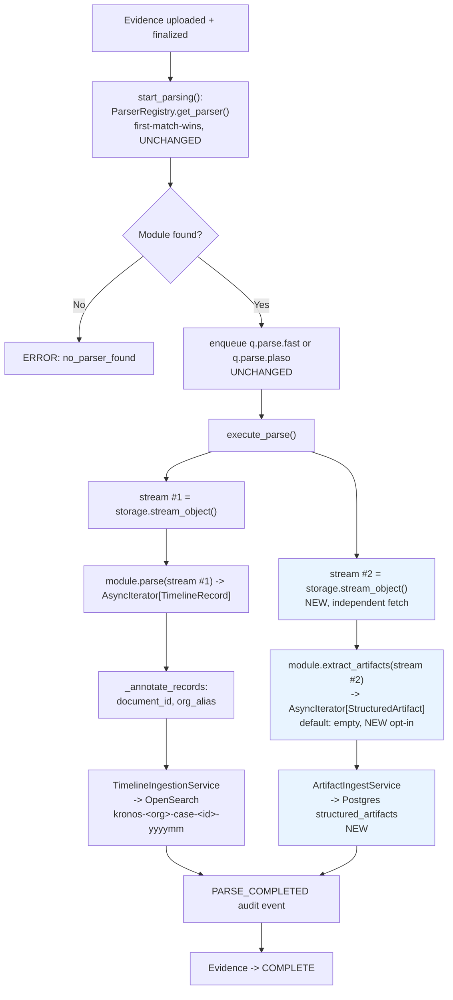

# Unified Data Source Module System — Architecture

**Status:** design, implemented incrementally starting 2026-07-24. Companion
to `reviews/DFIR_Artifact_Landscape.md` (what to ingest) and
`reviews/Extensibility_Architecture_Proposal.md` (containers/disk-images —
already shipped for ZIP/E01 — and the third-party-plugin trust model this
doc reuses unchanged for Track D).

**Goal.** Generalize KronOS's ingestion pipeline from "one artifact family
(Windows/KAPE) → one output shape (`TimelineRecord`)" to "any DFIR data
source → the right output shape for that data," so that adding Linux,
memory, mobile, network, or cloud modules in the future is a matter of
writing one class and registering it — never a change to orchestration,
storage wiring, or the API surface.

---

## 1. The problem, stated precisely

### 1.1 What already works and must not regress

KronOS's parser layer is genuinely good at one thing: turning a raw
artifact into a stream of `TimelineRecord`s (ECS-schema, one row per
discrete timestamped event), landing in per-tenant monthly OpenSearch
indices with full chain-of-custody provenance
(`kronos.evidence_id/case_id/org_id/sha256/parser/parser_version/
record_index/source_path/container_sha256`). Six parsers already do this
(CloudTrail, nginx, EVTX, Prefetch/registry/SQLite/journald/E01 via Plaso,
Chrome History, and `ZipArchiveParser`'s recursive KAPE-zip re-dispatch).
`ParsingOrchestrationService.execute_parse()` is a stable, well-tested
control flow: resolve one module via `ParserRegistry.get_parser()`
(first-match-wins), call `.parse()`, feed the output to
`TimelineIngestionService`. **This must not be disrupted** — six real
parsers and ~600 tests depend on that exact contract.

### 1.2 What breaks

`reviews/DFIR_Artifact_Landscape.md` catalogues dozens of real, common DFIR
artifacts whose *natural shape is not a timeline*: a Volatility `pstree`
(a parent/child tree), a NetFlow connection matrix (a graph), a `.plist`
config file (a snapshot with no "occurred at"), a memory region map, a
file-hash set. None of these is "a list of timestamped events" — the
model `TimelineRecord` encodes structurally assumes every artifact is.

Concretely, `ForensicParser.parse()`'s return type is
`AsyncIterator[TimelineRecord]`. There is no legal way for a parser to say
"here is a process tree" without either (a) lying — inventing a fake
timestamp and flattening the tree into disconnected rows, destroying the
PPID relationships that make it useful — or (b) being rejected by the type
system. Neither is acceptable. This is a **domain-model gap**, not a
missing parser.

### 1.3 The generalization

The fix generalizes past "add a `pstree` special case" to the actual
shape of the problem: **every future data source will produce *some* mix
of timeline-shaped and non-timeline-shaped output, in proportions that vary
per source** (cloud audit logs: ~100% timeline; Volatility: mostly
non-timeline; UAC Linux collection: mostly timeline with a few state
snapshots; mobile extractions: timeline messages + a non-timeline file
tree). The architecture must let **one module emit both**, and must give
non-timeline output a real home — not silently drop it, not force it into
OpenSearch's timeline index, not block on inventing a presentation/analysis
UI for it (explicitly out of scope for this pass, per product direction:
capture and store safely now, decide presentation later).

---

## 2. Design decisions (and why the alternatives were rejected)

| Decision | Rejected alternative | Why |
|---|---|---|
| **Extend `ForensicParser`** with an optional second output method, rather than introduce a parallel "Module" class hierarchy | A new `DataSourceModule` ABC replacing `ForensicParser` | Would force a rewrite of all 6 existing parsers + orchestration + DI wiring for zero behavioral gain. `ForensicParser` already *is* "the unified module concept" the brief asks for — extending it keeps exactly one interface for module authors to learn, per CLAUDE.md A.4 ("extensibility through abstraction, not configuration"). |
| **Default the new method to an empty generator** in the ABC itself | Making it `@abstractmethod` | Zero migration cost: all 6 existing parsers compile and behave identically with no code change. Only modules that actually have non-timeline output override it. |
| **Keep `ParserRegistry.get_parser()` single-dispatch** (first-match-wins, one module per evidence file) | A multi-dispatch registry running every applicable module | `PlasoParser` already proves the right pattern: **one module internally orchestrates many sub-analyses** (EVTX/prefetch/registry/journald all inside one Plaso invocation) and yields a single combined stream. A future `VolatilityModule` does the same — it runs `timeliner` *and* `pstree` *and* `malfind` internally and yields a mixed `TimelineRecord`/`StructuredArtifact` stream from one `.parse()`/`.extract_artifacts()` pair. No registry/dispatch change needed at all. |
| **New `StructuredArtifact` domain type, reusing `KronosProvenance` verbatim** | A bespoke provenance shape per artifact kind | Every artifact — timeline or not — needs the exact same custody guarantees (evidence_id/case_id/org_id/sha256/source_path/container_sha256). Reusing the block means one audit story platform-wide, not two. |
| **Store `StructuredArtifact`s in Postgres (JSONB), not OpenSearch** | A new OpenSearch index alongside the timeline indices | OpenSearch's ECS index template is built for the "flat searchable event" shape; `content` here is *intentionally opaque and per-kind heterogeneous* (a tree today, a graph tomorrow) — forcing a mapping decision now would mean guessing at query/UI needs nobody has defined yet. Postgres JSONB (matching the existing audit-log/case/evidence repository pattern already in this codebase) stores it safely and queryably-by-metadata (kind/evidence_id/case_id) without inventing a premature schema for the payload. Revisit if/when a presentation layer is designed. |
| **`kind` is a free-form namespaced string** (`"volatility.pstree"`), not an enum | A closed `ArtifactKind` enum | New modules must be able to introduce new kinds *without a code change to the domain layer* — CLAUDE.md A.4's whole point. A module declares its own kind strings; nothing centrally enumerates them. |
| **Reuse the existing two-tier trust model unchanged** (`reviews/Extensibility_Architecture_Proposal.md` §4) | Design a new sandboxing story for "modules" | The trust boundary (first-party in-process/subprocess-sandboxed vs. future third-party fully-sandboxed) doesn't change based on *what* a module outputs, only on *whose code it runs*. No new security design needed — just apply the existing one to more modules. |

---

## 3. The `StructuredArtifact` domain type

```python
# src/domain/artifact.py — pure domain, zero framework imports (same layering rule as timeline.py)

class StructuredArtifact(BaseModel):
    """A piece of forensic evidence that is not a timeline event.

    Examples: a Volatility pstree, a NetFlow connection matrix, a .plist
    snapshot. `content` is intentionally opaque (module-defined shape) --
    see reviews/Data_Source_Module_System.md for why no per-kind schema is
    decided yet.
    """
    model_config = {"frozen": True}

    artifact_id: uuid.UUID
    kind: str                      # namespaced, e.g. "volatility.pstree" -- module-declared, not enumerated
    content: dict[str, Any]        # opaque; module-defined shape
    kronos: KronosProvenance       # SAME provenance block as TimelineRecord
```

`KronosProvenance` is imported from `src.domain.timeline` (already
additive/generic — `source_path`/`container_sha256` already exist from the
KAPE-zip work and apply identically here: a `pstree` extracted from a
memory image that arrived inside a KAPE zip still needs to say which file
it came from).

---

## 4. The `ForensicParser` ABC extension

```python
# src/application/parsing.py — the ONE new method, additive

class ForensicParser(ABC):
    ...
    @abstractmethod
    async def parse(self, stream, evidence, tenant) -> AsyncIterator[TimelineRecord]:
        ...  # UNCHANGED — every existing parser keeps working with zero edits

    async def extract_artifacts(
        self, stream: AsyncIterator[bytes], evidence: Evidence, tenant: TenantContext
    ) -> AsyncIterator[StructuredArtifact]:
        """Yield non-timeline structured artifacts this parser can produce.

        Concrete default: yields nothing. Override only if this module
        produces artifacts that don't belong in a timeline (see
        reviews/DFIR_Artifact_Landscape.md §10 for the real, named
        examples this exists for).
        """
        return
        yield  # pragma: no cover -- makes this a real async generator
```

This is a **concrete method with a real default body**, not
`@abstractmethod` — the critical property that makes this a zero-migration
change for all 6 existing parsers.

---

## 5. Orchestration change

`ParsingOrchestrationService.execute_parse()` gains exactly one new step,
after the existing `parse()` pass completes unchanged:

```python
parser = await self._detect_parser(evidence, evidence_key)          # UNCHANGED

stream = await self._storage.stream_object(evidence_key, bucket="evidence")
annotated = _annotate_records(parser.parse(stream, evidence, tenant), ...)  # UNCHANGED
count = await self._timeline_ingest.ingest_records(annotated, tenant, evidence_id)  # UNCHANGED

# NEW: a second, independent pass -- a fresh stream fetch, same pattern
# _detect_parser already uses for its own separate header-peek fetch.
artifact_stream = await self._storage.stream_object(evidence_key, bucket="evidence")
artifacts = parser.extract_artifacts(artifact_stream, evidence, tenant)
artifact_count = await self._artifact_ingest.ingest_artifacts(artifacts, tenant, evidence_id)
```

**Known, deliberate v1 tradeoff:** `parse()` and `extract_artifacts()` each
independently fetch/buffer the evidence (a third `stream_object()` call per
evidence, exactly like `_detect_parser`'s own separate header-peek fetch
already does today — not a new pattern). For a multi-gigabyte memory image
this means buffering the file twice if a module implements both methods.
Accepted for v1 for simplicity and because it changes nothing about
existing control flow; flagged in §8 as a real follow-up (cache the
buffered temp file across both calls, scoped to one Celery task) rather
than solved speculatively now.

---

## 6. Storage: `ArtifactRepository`

Mirrors the existing `CaseRepository`/`EvidenceRepository`/
`AuditLogRepository` pattern exactly (ABC in `src/adapter/repository/`,
`PostgresXRepository` implementation using SQLAlchemy Core, a
`create_tables()` classmethod using the shared advisory lock in
`_schema_lock.py`).

```
structured_artifacts (Postgres table)
  artifact_id   UUID PRIMARY KEY
  evidence_id   UUID, indexed
  case_id       UUID, indexed
  org_id        UUID, indexed        -- tenant isolation, same invariant as every other table
  kind          VARCHAR(255), indexed
  parser        VARCHAR(128)         -- kronos.parser, e.g. "volatility"
  parser_version VARCHAR(64)
  source_path   TEXT, nullable
  container_sha256 VARCHAR(64), nullable
  record_index  INTEGER
  content       JSONB
  created_at    TIMESTAMPTZ
```

`ArtifactIngestService` (new, mirrors `TimelineIngestionService`'s shape:
batches, audits `ARTIFACT_INGEST_STARTED`/`_COMPLETED`/`_FAILED` via the
existing `AuditLogService`) is the only writer.

---

## 7. Flowchart



Blue = new. Everything else is the exact existing control flow, unchanged.

---

## 8. Two-tier trust model — reused unchanged

`reviews/Extensibility_Architecture_Proposal.md` §4 already designed the
security boundary this system needs and it does not change here:

- **First-party modules** (a future `VolatilityModule`, `UacArchiveModule`,
  `ZeekLogParser`, etc.) — in-process if pure-Python/stdlib-safe (like
  `ChromeHistoryParser`), or subprocess-sandboxed at the container level if
  they shell out to a real external tool (like `PlasoParser`'s
  `FirecrackerLauncher` pattern — `volatility3`'s CLI, Hayabusa's Rust
  binary, `mac_apt`, etc. would all follow this exact precedent, not a new
  mechanism).
- **Third-party/dynamic plugins** — still Track D
  (`SandboxedExternalParser`, manifest + Cosign/Trivy gate, no-network/
  no-secrets sandbox), still explicitly **not started**, still gated behind
  first-party modules being solid, per that document's own sequencing.
  `StructuredArtifact` output from a sandboxed plugin would be
  schema-validated at the trust boundary exactly like `TimelineRecord`
  output already is designed to be (§4.1 of that doc) — no new leak vector.

**Security note specific to `content: dict[str, Any]`:** because artifact
content is intentionally opaque, a compromised or buggy module could in
principle stuff excessive data into it. `ArtifactIngestService` must cap
`content` size per artifact (a real, enforced limit — mirroring the
zip-bomb per-member cap `ZipArchiveParser` already enforces) before the
Postgres write, not defer this to "later." This is implemented alongside
the ingest service, not left as a TODO — see CLAUDE.md's new module rules
for the required limit.

---

## 9. Known follow-ups (explicitly deferred, not silently dropped)

1. **Double-buffering for large evidence** (§5) — cache the temp file
   across `parse()`/`extract_artifacts()` within one Celery task's
   lifetime instead of two independent `stream_object()` fetches.
2. **Presentation/analysis of `StructuredArtifact` content** — explicitly
   out of scope per product direction ("on réfléchira plus tard"). The
   `kind` catalogue in `reviews/DFIR_Artifact_Landscape.md` §10 is the
   grounded input for that future design; nothing here should be read as
   pre-deciding it.
3. **Querying/searching across artifact `content`** — Postgres JSONB
   supports `@>`/path queries if needed later; no index strategy chosen
   yet beyond the metadata columns (kind/evidence_id/case_id/org_id).
4. **Module manifest/declared-`kind` registry** — for now, a module's
   `extract_artifacts()` docstring is the only place its `kind` values are
   documented (see CLAUDE.md's new module-authoring checklist). A central
   machine-readable catalogue (useful once Track D dynamic plugins declare
   `kind`s in their manifest) is future work, not needed while all modules
   are first-party/in-repo.
